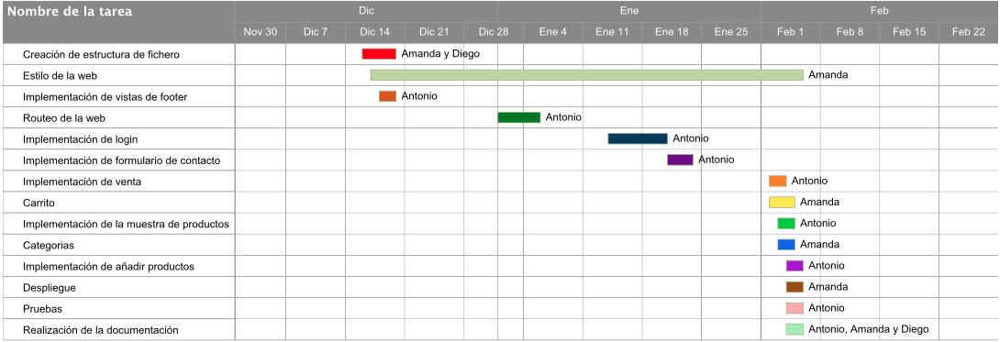

<h1>Documentación de Náutica Barata</h1>
<a href="http://nauticabarata.esy.es">Enlace al sitio web</a>
Nota: para entrar como administrador y ver el enlace a añadir producto:
Usuario:administrador
Contraseña:1234

<h2>ÍNDICE</h2>

<ol>

<li>ESTRUCTURA DE FICHEROS</li>
<li>MODELO VISTA CONTROLADOR</li>
<li>BOOTSTRAP</li>
<li>ANGULAR JS</li>
<li>PREPROCESADORES</li>
<li>HEROKU</li>
<li>GIT</li>
<li>PROBLEMAS ENCONTRADOS</li>
<li>REPARTO DE TAREAS</li>
<li>PRUEBAS</li>
<li>IDEA DEL PROYECTO</li>
<li>GRUNT</li>

</ol>

1.ESTRUCTURA DE FICHEROS:
-------------------------
La estructura de ficheros ha sido desplegada con Yeoman. Se utiliza el modelo
vista controlador cuyas vistas están almacenadas en la carpeta views. Las imágenes
referentes a los productos están almacenadas en la carpeta images, mientras que las
imágenes referentes a la decoración de la página y el despliegue con Bootstrap se 
almacenan en la carpeta assets.

En cuanto a javascript y angular (controladores, factorías...) está almacenado
en el directorio scripts. Además, en ese directorio podemos encontrar varios
archivos JSON que almacenan toda la información sobre productos, usuarios, carrito,
categorías... Hemos decidido almacenarlo en esa carpeta ya que estos archivos son 
accedidos desde los propios archivos de javascript.

Por último podemos encontrar otros directorio que contienen módulos de node,
(node_modules), módulos de angularjs (bower_components) y directorios necesarios para el
despliegue de Bootstrap (styles, fonts...).

2.MODELO VISTA CONTROLADOR:
---------------------------
Como ya se ha mencionado, se ha hecho uso del modelo vista controlador. Desde
la vista principal podemos acceder a las vistas restantes: página de login, condiciones
generales, checkout, blog, carrito, cuenta de usuario, horario, detalles de productos, 
envío de email, pantalla de error (404)...
	
Para realizar este cambio de vistas se ha configurado la aplicación de angular 
mediante "$routeProvider", redirigiendo la vista a dónde se desee.

3.BOOTSRAP
----------
Para la realización de este proyecto se ha partido de una plantilla de 
Bootstrap para una tienda electrónica y que ha sido adaptada a nuestras
necesidades.
Además se ha implementado el diseño de forma que es Responsive.
	

4.ANGULAR JS
------------
A continuación se describirá de manera general como hemos introducido angular
en nuesto proyecto.
	
4.1. Carrito
Se ha descargado e introducido un módulo de angular que simula un carrito de 
la compra.
	
4.2. Filtrado, repeticiones y otros.
En diferentes puntos del código se hace uso de estructurs tipo ng-repeat,
ng-model, filtros... entre otros.

4.3. Factorías y Controladores
Para cargar los datos almacenados en los ficheros JSON se usan factorías 
que almacenan esos datos en variables persistentes que son accedidas desde los
distintos controladores. Estos controladores se cargan desde distintos puntos 
de la página.

4.4. Modelo Vista Controlador
Descrito anteriormente.

4.5. Control de Usuarios
Vista de login y controladores de login.js así como users.json, estos elementos están encargados de controlar el acceso de usuarios, para ello se permite registrarse, iniciar sesión y cerrar sesión, se controla que no se pueda crear dos usuarios con el mismo username, así como se restringe el acceso a la vista cuenta a cualquier persona no logeada. Tambien se controla que solo el administrador pueda acceder a añadir productos.

5.PREPROCESADORES
-----------------
Se ha empleado la versión sass de bootstrap. Y se han cambiado algunos colores de la plantilla en estos archivos.

6.DESPLIEGUE
--------
Se incluyen en el proyecto varios archivos necesarios para el despliegue de la
aplicación en el servidor Heroku. Estos archivos son Procfile, donde se indica "el punto de entrada" de la web y web.js, archivo necesario para que heroku funcione. Sin embargo, por motivos que no conocemos no es posible que la aplicación se vea correctamente en Heroku. Así que la hemos subido al servidor gratuito Hostinger.

7.GIT
-----
Se ha optado por almacenar el proyecto en el repositorio "www.github.com". 
Además se ha usado como editor el programa Brackets, al cual se le ha instalado un
plugin para poder acceder al repositorio de manera cómoda y simple.

8.PROBLEMAS ENCONTRADOS
-----------------------
En un principio se intentó integrar la base de datos MongoDB con Angular, pero 
a la hora de acceder a los datos desde los controladores surgía un error que no 
se ha podido corregir de ninguna forma. A simple vista parecía que todo estaba
correcto y se ha indagado durante muchas horas en el tema, pero finalmente no se 
ha conseguido solventar este error y se decidió almacenar la información un ficheros 
JSON, aunque la información si que se almacenaba de forma correcta en la base de datos
de MongoDB.

Existió además otro problema a la hora de sincronizar archivos modificados en
paralelo con git. Si más de una persona había modificado el archivo a la vez, una 
vez que se unía se generaba basura. La solución fue hacer un reparto concienzudo
de la tarea para que cada participante del proyecto no modificara un fichero que 
no le perteneciera.

9.REPARTO DE TAREAS
-------------------
El reparto de tareas ha quedado de la siguiente forma:

<h4>ANTONIO:</h4>
<ul>
<li>Encargado del "routeo" de la web</li>
<li>Encargado de la implementación de login.js</li>
<li>Encargado de la implementación de la vista login</li>
<li>Encargado de la realización del json users</li>
<li>Encargado del la implementación de todas las vistas del footer(vistas: condiciones generales, política de privacidad...)</li>
<li>Encargado de la implementación de la vista add-prod</li>
<li>Encargado de la implementación de productos.js</li>
<li>Encargado de la implementacion de la vista contact us</li>
<li>Encargado de la implementacion de sendemail.php</li>
<li>Encargado de la implementacion de emailventa.php</li>
<li>Encargado de la implementacion de la vista venta.html</li>
<li>Encargado de la implementacion de la vista cuenta.html</li>
</ul>

<h4>AMANDA:</h4>
<ul>
<li>Encargada de la creación de toda la estructura de la aplicación</li>
<li>Encargada de la parte "visual" de la web, estilo, vistas, colores, estructura...</li>
<li>Encargada de la adaptación del módulo ngcart (carrito) a la aplicación, traducción e implementación</li>
<li>Encargada de la implementación de la vista Carrito</li>
<li>Encargada de la implementación de la distribución por categorías de los productos</li>
<li>Encargada de la realización del json de productos</li>
<li>Encargada de realizar el despliegue en el servidor</li>
			</ul>

<h4>DIEGO:</h4>
<ul>
<li>Encargado de la implementación, implantación y manejo de la base de datos.</li>
<li>Encargado de redactar la documentación.</li>
<li>Diferentes tareas en la implementación de Angular (filtrado, selección...)</li>
</ul>

y la planificación temporal se puede ver en la siguiente imagen

10.PRUEBAS
-----------
Se han realizado pruebas a las hojas de estilo mediante la web 
    http://jigsaw.w3.org/css-validator/#validate_by_upload
aparecen algunos errores en algunos de los css otros son satisfactorios (Nosotros apenas hemos tocado los css, mayormente hemos aplicado las clases que éstos formatean).

También se han realizado pruebas a los html mediante esta otra web 
    http://validator.w3.org/check
Hemos obtenido algunos errores en algunas vistas al usar ng-model en inmput, pero, dado que esto se usaba en tutoriales de angularjs y la aplicacion web funciona sin que aparezcan errores en consola no le hemos dado mayor importancia.
siendo, despues de algunos cambios, también satisfacctorias.

La aplicación funciona y se ve bien en los navegadores más comunes. Esto se ha comprobado con la web        
    http://browsershots.org/http://nauticabarata.esy.es/app/

11.IDEA DEL PROYECTO
---------------------

La idea surge de la página web <a href="http://www.nauticabarata.com">Náutica Barata</a> que como se puede ver está creada con una herramienta de creación de páginas web que deja mucho que desear, es una página lenta y mal estructurada, cuya navegación no es nada intuitiva.

12.GRUNT
--------

Se ha empleado grunt (uglify) para la reducción de ficheros automática. Se ha creado un fichero gruntfile.js para configurar toda la automatización de procesos, entre otros la instalación de dependencias mostradas en package.json. El directorio distribuido (/dist) se ha creado haciendo grunt build. Y durante el desarrollo hemos usado el servidor local creado por grunt serve para ver los cambios.